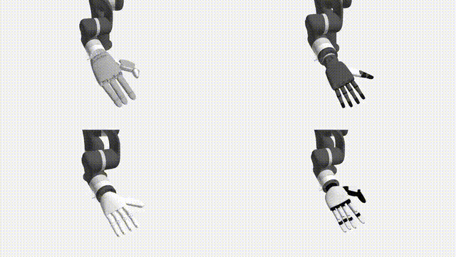

# DexLatent

DexLatent official implementation of the paper [XL-VLA (CVPR 2026)](https://xl-vla.github.io)



## Inference and Visualization

Run with our pretrained checkpoint:

```bash
uv run -m HandLatent.infer
```

By default, inference reads `Dataset/demo.npz` and visualizes:

- source trajectory (origin)
- four decoded trajectories (`xhand`, `ability`, `inspire`, `paxini`)

## Train

Run the training script with:

```bash
uv run -m HandLatent.train
```

Checkpoints are written to:

- `Checkpoints/<timestamp>/checkpoint_epoch_XXXX.pt`
